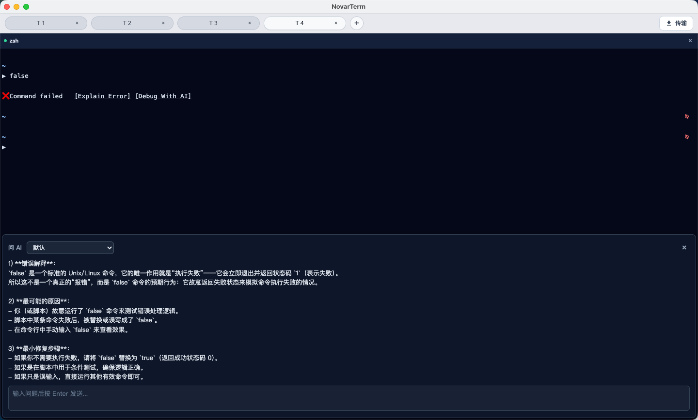
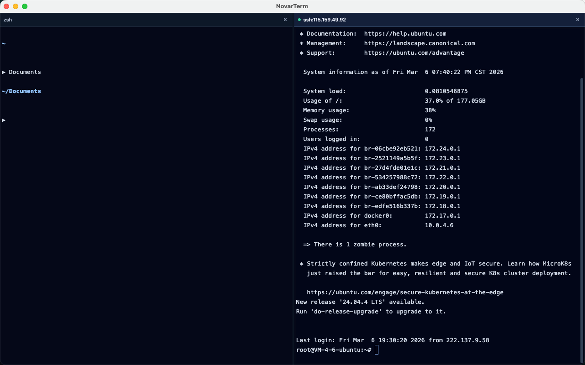
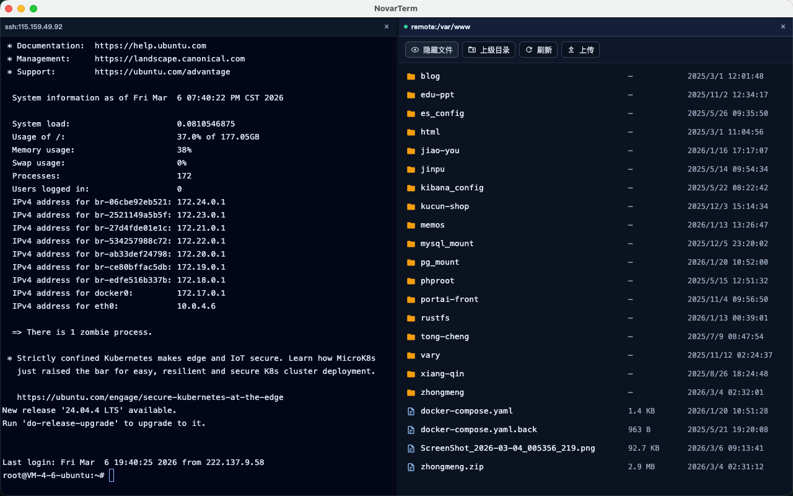
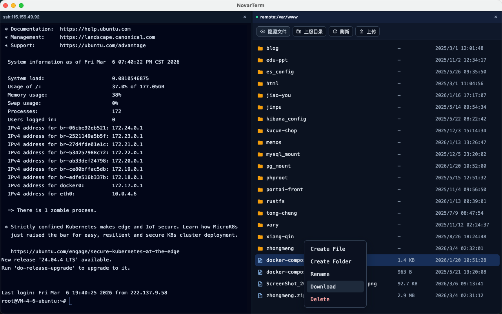
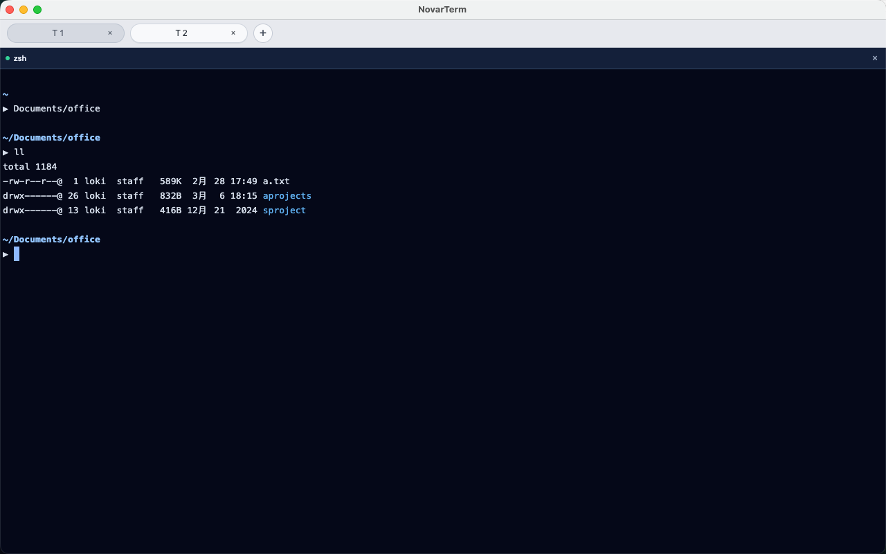
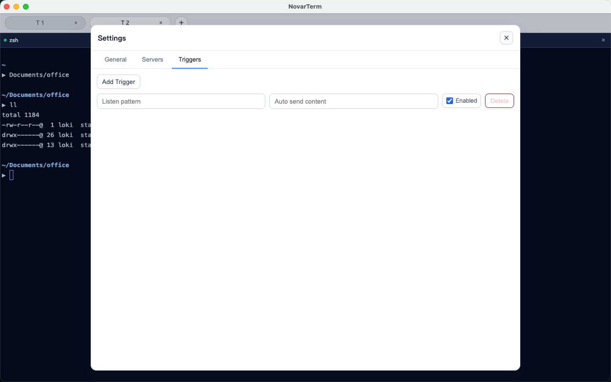

# NovarTerm

[English](README.md) | [简体中文](README.zh-CN.md)

面向开发者与 DevOps 团队的 AI 优先终端工作空间。

NovarTerm 是一款 AI 原生桌面终端，把 AI 助手放在你执行命令、查看日志、传输文件、管理远程会话的同一个工作界面里。

## 路线图与状态

NovarTerm 当前高层能力状态如下：

| # | 能力项 | 状态 | 说明 |
|---|---|---|---|
| 1 | AI 命令栏（聊天 / 解释 / 执行 / 插入） | ✅ | 核心流程已可用，包含流式返回、模型路由、上下文控制与语言策略。 |
| 2 | 结构化 AI 调试 | ✅ | 命中错误模式后可触发 `Debug with Novar`，并通过结构化上下文卡片加速定位问题。 |
| 3 | 多标签与多分屏工作区 | ✅ | 支持标签/分屏操作，并可在重启后恢复布局。 |
| 4 | SSH 远程会话工作流 | ✅ | 支持已保存服务器快速连接与手动 `ssh`。 |
| 5 | 本地/远程统一文件面板 | ⚠️ | 基础浏览/上传/下载可用，更深层流程仍在持续完善。 |
| 6 | 可预期的拖拽规则 | ✅ | 拖入 Shell 插入路径，拖入远程面板触发确认上传。 |
| 7 | 集中式传输中心 | ✅ | 可统一查看传输进度与历史记录。 |
| 8 | 触发器自动化与国际化 | ⚠️ | 核心能力可用，高级规则与覆盖范围仍在扩展。 |
| 9 | 原生平台体验与深度系统集成 | ⚠️ | 偏好设置与平台特性体验正在持续打磨。 |
| 10 | Windows/Linux 全量平台验证 | ⚠️ | 目前优先完成 macOS 验证，其它平台正在推进。 |
| N | 后续高级功能扩展 | ❌ | 预留给后续 roadmap 条目。 |

状态说明：`✅ 已可用` · `⚠️ 进行中 / 部分可用` · `❌ 规划中`

## 详细能力说明

### 1) AI 命令栏（核心流程）

- `Send` 与 `Explain` 支持流式响应（SSE）。
- 支持连续追问，并提供 `Explain`、`Run`、`Insert` 等显式操作。
- 模型路由策略清晰：内置模型走代理，自定义模型走用户配置直连。
- 上下文控制策略明确：请求最多携带最近 2 条历史消息，控制上下文长度与成本。
- 响应语言支持自动识别，也可在设置中手动锁定。
- 按动作类型构造请求，行为边界明确：`Send` 发送当前输入 + 最近上下文窗口；`Explain` 发送选中的命令/输出上下文 + 最近上下文窗口；`Run` 在同一界面串联“AI 解释 + 终端执行”；`Insert` 仅将生成内容写入终端输入框，不强制立即执行。
- 流式生命周期在 UI 可感知（开始、增量返回、完成、失败），便于区分“还在生成”与“结果已结束”。
- 异常可恢复：网络或模型失败时不会破坏会话上下文，支持继续重试。

### 2) Debug with Novar

- 当终端输出命中常见错误模式时，展示 `Debug with Novar` 入口。
- 调试请求使用结构化上下文，不只是一段纯文本，包含 `用户输入（User Prompt）`、`终端输出（Terminal Output）`、`执行命令（Executed Command）`。
- 调试流程保持在当前终端线程内完成，减少切到外部工具带来的上下文丢失。
- 结构化卡片能清晰分离“你想做什么 / 实际执行了什么 / 哪一步出错”，降低歧义。

### 3) 终端工作区（Tab + Pane）

- 多 Tab：支持新建、关闭、切换、拖拽重排。
- 多 Pane：支持水平分屏、垂直分屏、关闭当前 Pane。
- 分屏会继承会话语义（本地/远程上下文与路径提示）。
- 支持重启恢复：可在应用重启后恢复 Tab/Panes 工作区布局。

### 4) 远程会话工作流

- 支持保存远程服务器配置（新增、编辑、删除）。
- 支持从终端右键菜单一键发起连接。
- 支持手动 `ssh ...` 登录路径，保留命令行可控性。
- 连接失败时提供明确反馈，便于重试或快速切换目标。

### 5) 统一文件面板（本地 + 远程）

- 单一文件面板可在本地与已保存远程服务器之间切换数据源。
- 本地面板支持浏览、进目录、返回上级、新建、重命名、删除。
- 远程面板支持浏览、进目录、返回上级、新建、重命名、删除、上传、下载。
- 远程上传支持文件与目录，目录上传会保留相对路径结构。
- 同名冲突规则明确：同名文件按覆盖处理，同名目录冲突会明确提示。

### 6) 拖拽与传输规则

- 拖拽到 Shell：仅插入文件/目录路径，不触发上传。
- 拖拽到远程文件面板：弹出确认后执行上传。
- 拖拽到本地文件面板：不触发上传。
- Tab 栏传输中心可统一查看上传/下载进度与历史记录。

### 7) 触发器自动化

- 支持基于终端输出关键字匹配触发规则。
- 每条触发器可独立启用/禁用。
- `启用`：控制匹配后是否将配置内容写入终端输入框。
- `自动发送`：控制写入后的内容是否自动回车提交。
- 默认关闭自动发送，降低误触发风险。

### 8) 国际化与可用性基线

- 核心流程支持中英文切换。
- i18n 覆盖终端、文件面板、AI 交互、设置、错误提示、确认弹窗。
- 设置页包含常用快捷键说明（含 `Command + K` 切换 AI 命令栏）。

### 当前约束（重要）

- 文件上传能力仅在远程文件面板下可用。
- Shell 拖拽严格限定为“路径插入”，不承担传输行为。
- 平台验证当前以 macOS 为先，Windows/Linux 仍在持续推进。

## 文档

- 面向用户的功能概览：[docs/app-features-overview.md](docs/app-features-overview.md)
- 面向工程的能力矩阵：[docs/app-technical-capability-matrix.md](docs/app-technical-capability-matrix.md)

## 截图

